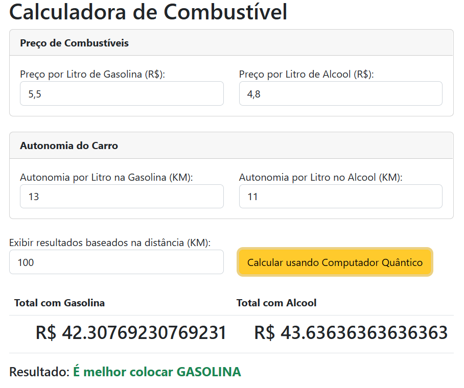

# React App to Calc Car performance with Gasoline and Alcohol

Available in: [Fuel Calc](https://digao-dalpiaz.github.io/FuelCalc/)

This Web Application was developed using React. Te main proposal is to calculate difference between Gasoline and Alcohol prices assuming that you know your car autonomy.

*Only available in Portuguese language.*
